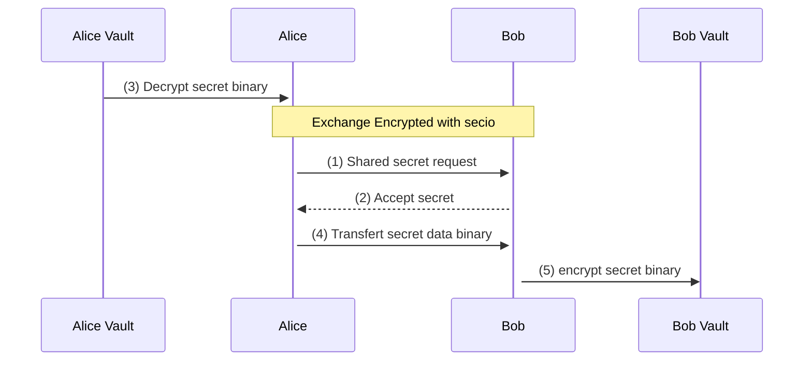

## Secret p2p exchange

1. Alice send sharing secret request with data: `KeyPath, RequestId, Expiration`
2. Bob accept (and store infos in bbolt) or decline request and respond with data: `RequestId, Accepted`
3. Alice receive response and if Accepted use Child Key to decrypt secret from bbolt 
4. Alice send secret to Bob with `RequestId, Blob`
5. Bob verify the RequestId has been accpeted before encrypt secret with his Child Key in bbolt

* request must have expiration delay: 5min default

| Keywords | Definition |
| ------ | ------ |
| RequestId | the request id are used to trace the secret sharing to avoid malicious secret substitution |
| KeyPath | Namespace and Secret name represent a path where secret is stored | 
| Accepted | Boolean to know if secret is accepted by receiver or not |
| Expiration | The expiration date of request in format RFC3339 |